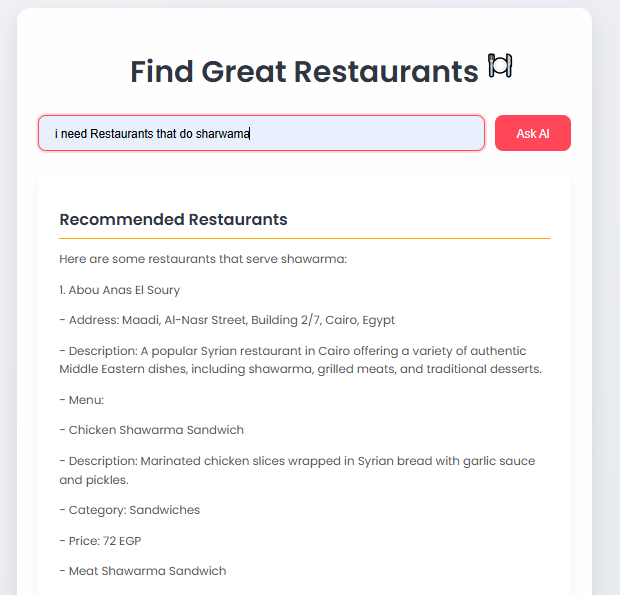

# AI-Powered Restaurant Finder

## Overview
This project is a web application that utilizes the OpenAI API to provide an AI-powered restaurant assistant. The application allows users to search for restaurants, view menu details, and receive intelligent recommendations based on their queries. The backend is built using Flask, while the frontend is developed with HTML, CSS, and JavaScript.

<p align="center">
  
  
  <br>
  
  
</p>

---

## Features
- **AI-Powered Search**: Users can ask questions in both English and Arabic about restaurants, menu items, and pricing.
- **Dynamic Recommendations**: The assistant processes user queries and provides personalized restaurant recommendations.
- **Data-Driven Insights**: The application utilizes restaurant data to enhance search capabilities.
- **Custom AI Assistant with RAG (Retrieval-Augmented Generation)**: The assistant is specifically trained on restaurant-related data stored in a vector database, ensuring highly relevant responses.
- **REST API**: The project includes an API endpoint that allows external applications to interact with the AI assistant.

---

## AI Assistant Details
This project does not simply use an OpenAI API key; instead, it creates a custom AI assistant trained with RAG on restaurant-related data. 

- **Custom Assistant Creation**: The assistant is created and configured using `CreatingAssistant.py`, where it is initialized with specialized instructions and trained with structured restaurant data.
- **Vector Store for Enhanced Search**: A vector database is used to index and retrieve restaurant information efficiently.
- **Restaurant-Specific Query Handling**: The assistant processes structured restaurant data to respond accurately to user queries.

---

## Project Structure
```
.
├── app.py
├── Api_Manager.py
├── CreatingAssistant.py
├── UsingAssistant.py
├── Data/
│   ├── egyptrestaurants.txt
├── Scripts/
│   ├── Data_Extractor.py
│   ├── restaurantmenuchanges.csv
│   ├── restaurants_data.json
│   ├── restaurants_data.txt
├── static/
│   ├── script.js
│   ├── style.css
├── templates/
│   ├── index.html
```

### Key Files and Their Roles

#### `app.py`
- Main Flask application file.
- Initializes the Flask app and OpenAI client.
- Handles HTTP requests and renders the main webpage.

#### `Api_Manager.py`
- Provides additional API routes and endpoints.
- Defines `/api/ask` for external access to the AI assistant.

#### `CreatingAssistant.py`
- Configures and initializes the AI assistant.
- Uploads restaurant data to OpenAI and sets up a vector store for enhanced search.

#### `UsingAssistant.py`
- Demonstrates how to interact with the AI assistant programmatically.
- Includes example queries in multiple languages.

#### `Data/`
- Contains restaurant-related data files, such as `egyptrestaurants.txt`.

#### `Scripts/`
- Includes scripts for data extraction and processing, such as `Data_Extractor.py`.

#### `static/`
- Contains frontend assets:
  - `script.js`: Manages frontend interactions with the AI assistant.
  - `style.css`: Defines the visual appearance of the web application.

#### `templates/`
- Stores HTML templates.
  - `index.html`: Main user interface template for interacting with the assistant.

---

## Installation & Setup
### Prerequisites
- Python 3.7+
- Flask
- OpenAI API Key

### Steps
1. Clone the repository:
   ```bash
   git clone https://github.com/your-repo-name.git
   cd your-repo-name
   ```
2. Install dependencies:
   ```bash
   pip install -r requirements.txt
   ```
3. Set up OpenAI API credentials:
   ```bash
   export OPENAI_API_KEY='your-api-key'
   ```
4. Run the application:
   ```bash
   python app.py
   ```
5. Access the application in a web browser:
   ```
   http://127.0.0.1:5000
   ```

---

## Usage
### Web Interface
- Open the application in your browser.
- Enter a query such as *"Find Italian restaurants near me"* or *"What are the cheapest sushi places?"*.
- The AI assistant will provide relevant responses.

### API Endpoint
- Send a POST request to `/api/ask` with a JSON payload:
  ```json
  {
      "prompt": "Recommend a restaurant with good seafood."
  }
  ```
- The API will return a JSON response with restaurant recommendations.

---

## Future Improvements
- **Integration with Google Maps API** for better location-based recommendations.
- **User Authentication** to save preferences and order history.
- **Improved NLP Processing** to enhance AI understanding of complex queries.
- **Mobile App Version** for easier accessibility on mobile devices.

---

## Contributors
- **Mahmoud Hany** - Lead Developer

---

## License
This project is licensed under the MIT License.

